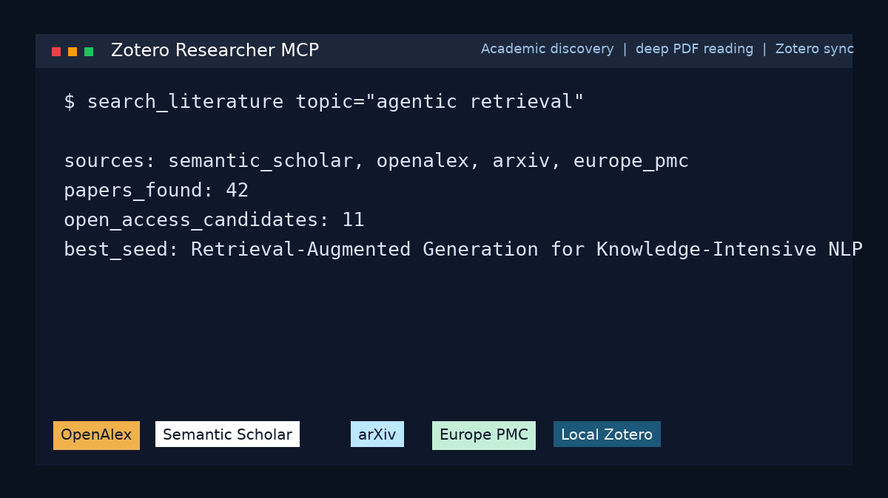

# Deep Research

**Open-source Deep Research that actually reads the papers.**

Everyone's selling "Deep Research" behind paywalls. They scrape some web results, summarize a few abstracts, and call it analysis.

This does what they don't. It downloads the actual PDFs, reads them cover to cover, pulls out evidence with citations, renders the figures so your AI can see them, and saves everything to your Zotero library. It works with Claude, Codex, and any MCP client.

[](https://github.com/aytzey/academic-research-mcp/actions/workflows/ci.yml)
[](LICENSE)
[](pyproject.toml)
[](https://github.com/aytzey/academic-research-mcp/stargazers)

---



## One prompt. Full pipeline.

```
Research retrieval-augmented generation, deep-read the top papers, and compare the methods.
```

Your AI will:

1. Search **Semantic Scholar**, **OpenAlex**, **arXiv**, **Crossref**, and **Europe PMC**
2. Find the open-access PDFs, not just abstracts
3. Download and read them cover to cover
4. Extract evidence chunks with source attribution
5. Render specific pages so it can *see* the figures and tables
6. Write a structured Markdown report
7. Save everything into your **Zotero** library

One prompt. Six academic databases. Real PDFs. Real citations.

---

## Why this exists

| | Paid "Deep Research" | This project |
|---|---|---|
| Reads actual PDFs | Nope. Web summaries. | Full text extraction |
| Figures and tables | Text only | Page rendering to PNG |
| Your library | Locked in their UI | Syncs to Zotero |
| Sources | Generic web search | 6 academic databases + Sci-Hub + LibGen |
| Cost | $200/month | Free, MIT licensed |
| Your data | Their cloud | Your machine |

---

## Get started

```bash
git clone https://github.com/aytzey/academic-research-mcp.git
cd deep-research
uv venv && source .venv/bin/activate
uv sync
cp .env.example .env
uv run deep-research-mcp
```

Point your MCP client at it. Start asking questions.

<details>
<summary><strong>Claude Desktop config</strong></summary>

```json
{
  "mcpServers": {
    "deep-research": {
      "command": "uv",
      "args": ["--directory", "/path/to/deep-research", "run", "deep-research-mcp"],
      "env": {
        "OPENALEX_EMAIL": "you@example.com",
        "UNPAYWALL_EMAIL": "you@example.com",
        "ZOTERO_LOCAL": "true"
      }
    }
  }
}
```

Full config: [examples/claude-desktop.mcp.json](examples/claude-desktop.mcp.json)
</details>

<details>
<summary><strong>Codex config</strong></summary>

```toml
[mcp_servers.deep_research]
command = "uv"
args = ["--directory", "/path/to/deep-research", "run", "deep-research-mcp"]

[mcp_servers.deep_research.env]
OPENALEX_EMAIL = "you@example.com"
UNPAYWALL_EMAIL = "you@example.com"
ZOTERO_LOCAL = "true"
```

Full config: [examples/codex.config.toml](examples/codex.config.toml)
</details>

<details>
<summary><strong>Streamable HTTP mode</strong></summary>

```bash
uv run deep-research-mcp --transport streamable-http --host 127.0.0.1 --port 8000 --path /mcp
```
</details>

---

## Tools

| Tool | What it does |
|---|---|
| `research_topic` | Full pipeline: search, download, report, Zotero sync |
| `deep_read_topic` | Everything above + full-text extraction with evidence chunks |
| `render_pdf_pages` | PDF pages to PNG for figure and table inspection |
| `search_literature` | Fine-grained multi-source academic search |
| `find_similar_papers` | Related work expansion from a seed paper |
| `inspect_open_access_pdf` | OA availability check and PDF preview |
| `extract_local_pdf_text` | Text extraction from any local PDF |
| `search_scihub` | Search Sci-Hub by DOI, title, or keyword (opt-in) |
| `download_scihub_paper` | Download a paper via Sci-Hub by DOI (opt-in) |
| `search_libgen` | Supplementary shadow library search |
| `list_zotero_collections` | Browse your Zotero library |
| `healthcheck` | Verify all connections are up |

---

## Sci-Hub integration (opt-in)

Sci-Hub access is **disabled by default**. When enabled, it acts as a fallback for papers that are not available through open-access channels. To opt in, set:

```bash
SCIHUB_ENABLED=true
```

You can also customize mirrors:

```bash
SCIHUB_MIRRORS=https://sci-hub.se,https://sci-hub.st,https://sci-hub.ru
```

Once enabled, you can use `search_scihub` and `download_scihub_paper` directly, or pass `include_scihub=True` to `research_topic` / `deep_read_topic` for automatic fallback when OA PDFs are unavailable.

> **Disclaimer:** Sci-Hub integration is provided strictly for **educational and research purposes**. The authors of this project do not host, operate, or maintain Sci-Hub. Users are solely responsible for ensuring that their use of Sci-Hub complies with all applicable laws and institutional policies in their jurisdiction. By enabling this feature, you acknowledge that the authors do not endorse, encourage, or condone copyright infringement of any kind. Use this tool responsibly and in accordance with copyright laws.

---

## Who uses this

**PhD students** that don't want to spend a week on a literature review. Point it at your thesis topic, get back a structured comparison with real citations and the PDFs already in your Zotero.

**Research labs** that want to scan preprints weekly and auto-file them. Run `research_topic` on a schedule and keep your group library current.

**AI builders** that need their agents to work with real academic papers instead of web scraping snippets. This is the MCP server you've been looking for.

---

## How it works

```
Topic --> Search 6 databases --> Resolve OA PDFs --> Download
  --> [Sci-Hub fallback if enabled] --> Deep Read full text
  --> Extract evidence --> Render figures
  --> Markdown report --> Zotero sync
```

**Source priority** (OA-first by design):

1. Semantic Scholar open PDFs
2. OpenAlex OA locations
3. arXiv
4. Europe PMC
5. Unpaywall
6. Direct publisher links
7. Sci-Hub (opt-in fallback, disabled by default)
8. LibGen (supplemental, best-effort)

No paywalls by default. No scraping. Real open-access academic papers.

---

## Configuration

```bash
OPENALEX_EMAIL=you@example.com
UNPAYWALL_EMAIL=you@example.com
SEMANTIC_SCHOLAR_API_KEY=           # optional, higher rate limits

# Local Zotero integration
ZOTERO_LOCAL=true
ZOTERO_LIBRARY_TYPE=user
ZOTERO_CONNECTOR_URL=http://127.0.0.1:23119/connector/saveItems
ZOTERO_BRIDGE_URL=http://127.0.0.1:24119

# Web Zotero API (alternative to local)
ZOTERO_LIBRARY_ID=
ZOTERO_API_KEY=

# Sci-Hub (disabled by default)
SCIHUB_ENABLED=false
SCIHUB_MIRRORS=https://sci-hub.se,https://sci-hub.st,https://sci-hub.ru

# Institutional networks
HTTP_PROXY=
HTTPS_PROXY=
SSL_CERT_FILE=
```

## Local Zotero setup

Set `ZOTERO_LOCAL=true`, make sure Zotero is running with the local API enabled, install a bridge plugin for full write support, and run `healthcheck` to verify.

Tested with Zotero 8.0.4 on Linux (Flatpak). Works with any standard desktop install.

---

## Project structure

```
src/deep_research_mcp/
  server.py              MCP tools and pipeline orchestration
  config.py              Environment and settings
  services/
    academic.py          Multi-source scholarly search
    open_access.py       OA resolution and PDF downloads
    scihub.py            Sci-Hub paper resolution (opt-in)
    deep_read.py         Full-text extraction and page rendering
    zotero.py            Local and web Zotero integration
    reporting.py         Markdown report generation
    libgen.py            Supplementary LibGen support
```

Architecture details: [docs/ARCHITECTURE.md](docs/ARCHITECTURE.md)

---

## For AI agents

If you're an agent reading this repo:

- [AGENTS.md](AGENTS.md) -- shared operating guide
- [CLAUDE.md](CLAUDE.md) -- Claude Desktop and Claude Code setup
- [CODEX.md](CODEX.md) -- Codex setup
- [docs/CLIENTS.md](docs/CLIENTS.md) -- side-by-side client comparison

---

## Contributing

PRs welcome. The most impactful areas:

- New scholarly source adapters
- Better OA resolution logic
- PDF parsing improvements
- More MCP client configs

See [CONTRIBUTING.md](CONTRIBUTING.md).

---

## Disclaimer

This tool is designed for **academic research and educational purposes only**. The authors do not endorse or encourage any form of copyright infringement.

- Open-access features use only legal, publicly available sources (Semantic Scholar, OpenAlex, arXiv, Europe PMC, Unpaywall).
- Sci-Hub and LibGen integrations are **disabled by default** and provided as opt-in features. Users who enable these features are solely responsible for compliance with their local laws and institutional policies.
- The authors of this project do not host, operate, or control any third-party services referenced herein.

Please use this tool responsibly and respect intellectual property rights.

---

## License

MIT. Do whatever you want with it.

If this helps your research, [star the repo](https://github.com/aytzey/academic-research-mcp) and tell a colleague about it.
