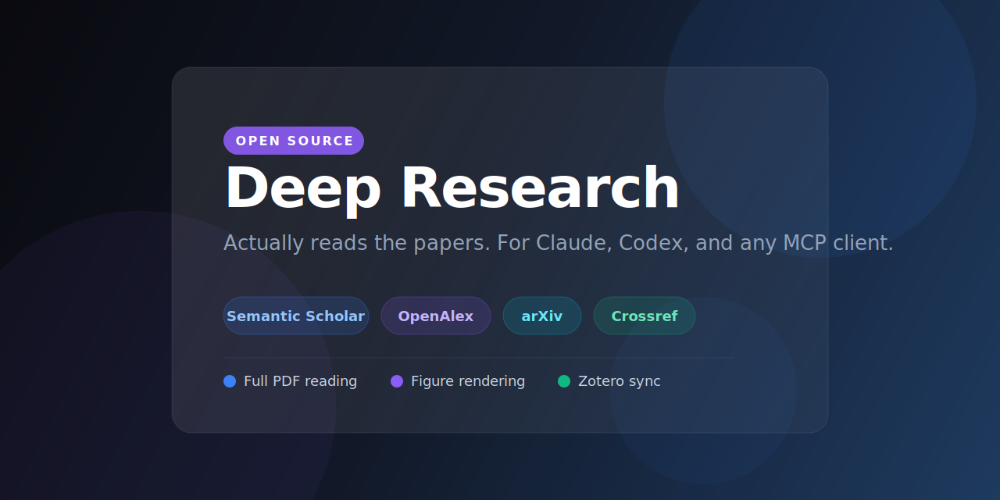

# Zotero Researcher MCP

[](https://github.com/aytzey/Zotero-Researcher/actions/workflows/ci.yml)
[](https://github.com/aytzey/Zotero-Researcher/blob/main/LICENSE)
[](https://github.com/aytzey/Zotero-Researcher/blob/main/pyproject.toml)
[](https://github.com/aytzey/Zotero-Researcher/stargazers)
[](https://github.com/aytzey/Zotero-Researcher/network/members)

An MCP server that turns an LLM into a practical research workflow:

- search across academic sources
- discover related papers
- download and inspect open-access PDFs
- extract full text and chunk evidence
- render PDF pages for figure and table review
- write results back into local Zotero or the Zotero Web API

This project is designed for Codex, Claude, and other MCP clients that need a single tool surface for literature discovery, document inspection, and reference management.

## At a Glance


## Why This Project

Most research agents can search and summarize. Very few can do the full loop well:

1. find papers from multiple scholarly sources
2. verify open-access availability
3. inspect the original PDF instead of only metadata
4. preserve the result in a real bibliography tool

`zotero-researcher-mcp` closes that gap with an OA-first research pipeline and a live local Zotero integration.

## Highlights

- Multi-source discovery via `Semantic Scholar`, `OpenAlex`, `arXiv`, `Crossref`, and `Europe PMC`
- OA enrichment through `Unpaywall`, `OpenAlex best_oa_location`, and publisher landing pages
- Optional `LibGen` support as a best-effort supplementary search layer
- Full-text extraction with chunk manifests for downstream agent reasoning
- PDF page rendering to PNG so an agent can inspect figures, tables, and layout directly
- Local Zotero mode with:
  - `pyzotero` local API reads
  - connector-based item save flow
  - bridge-based collection, note, and attachment writes
- Web Zotero API mode for remote or group libraries
- Proxy, custom CA, retry, and cache support for restrictive institutional networks

## Who It Is For

- Researchers who want an agent to produce a literature review and preserve the result in Zotero
- LLM tool builders who need a serious MCP surface for academic workflows
- Teams working behind restrictive university or enterprise networks
- Agents that need direct access to original PDFs, charts, tables, and page layouts

## Live-Verified Workflow

The local Zotero integration was verified against:

- `Zotero 8.0.4`
- Flatpak install on Linux
- local API on `127.0.0.1:23119`
- bridge endpoint on `127.0.0.1:24119`

The end-to-end smoke test successfully:

1. created a Zotero collection
2. added a journal article item
3. imported a PDF attachment
4. wrote a research note into the collection

## End-to-End Flow

`research_topic` runs the standard pipeline:

1. search multiple academic sources
2. merge and normalize records
3. find related papers from the strongest seed
4. enrich OA availability
5. download candidate PDFs
6. produce a Markdown report
7. optionally sync results into Zotero

`deep_read_topic` extends that flow:

1. extracts full text from downloaded PDFs
2. writes `*.txt` sidecars
3. writes `*.chunks.json` manifests
4. returns evidence chunks for the topic
5. returns absolute `pdf_path` values so an agent can open the original file
6. enables page rendering through `render_pdf_pages` for figure-level inspection

## Source Policy

The project is OA-first by default and prioritizes:

1. `Semantic Scholar` open PDF links
2. `OpenAlex` OA locations
3. `arXiv`
4. `Europe PMC`
5. `Unpaywall`
6. direct publisher OA links

`LibGen` support is intentionally treated as a supplementary, best-effort source. Mirror availability is unstable and may fail with `403`, `429`, TLS errors, or resets depending on the network environment.

## MCP Tools

- `healthcheck`
- `search_literature`
- `find_similar_papers`
- `inspect_open_access_pdf`
- `extract_local_pdf_text`
- `render_pdf_pages`
- `search_libgen`
- `inspect_libgen_item`
- `list_zotero_collections`
- `research_topic`
- `deep_read_topic`

## Example Use Cases

- Build a literature scan for a new thesis or grant topic
- Compare related work across multiple OA sources
- Let an agent inspect a figure-heavy PDF page by page
- Generate a report and archive the sources in a new Zotero collection
- Use Zotero locally without depending on a remote API key

## Project Layout

```text
src/zotero_researcher_mcp/
  server.py                  MCP tool surface
  config.py                  settings and environment loading
  services/academic.py       scholarly search and enrichment
  services/open_access.py    PDF download and OA resolution
  services/deep_read.py      full-text extraction and page rendering
  services/zotero.py         local and web Zotero integration
  services/reporting.py      Markdown report generation
  services/libgen.py         best-effort LibGen search helpers
tests/
docs/
```

For a deeper technical overview, see [docs/ARCHITECTURE.md](docs/ARCHITECTURE.md).

## Quick Start

```bash
uv venv
source .venv/bin/activate
uv sync
cp .env.example .env
uv run zotero-researcher-mcp
```

Streamable HTTP mode:

```bash
uv run zotero-researcher-mcp --transport streamable-http --host 127.0.0.1 --port 8000 --path /mcp
```

## Configuration

Example environment file:

```bash
OPENALEX_EMAIL=you@example.com
UNPAYWALL_EMAIL=you@example.com
SEMANTIC_SCHOLAR_API_KEY=

ZOTERO_LOCAL=true
ZOTERO_LIBRARY_TYPE=user
ZOTERO_CONNECTOR_URL=http://127.0.0.1:23119/connector/saveItems
ZOTERO_BRIDGE_URL=http://127.0.0.1:24119

HTTP_PROXY=
HTTPS_PROXY=
NO_PROXY=
SSL_CERT_FILE=
```

The project also supports:

- `ZOTERO_LIBRARY_ID`
- `ZOTERO_API_KEY`
- `ZOTERO_RESEARCHER_DATA_DIR`
- `CACHE_TTL_SEC`
- `LIBGEN_MIRRORS`
- `LIBGEN_TIMEOUT_SEC`

## Local Zotero Setup

Use local mode when Zotero is installed on the same machine as the MCP server.

Required environment:

```bash
ZOTERO_LOCAL=true
ZOTERO_LIBRARY_TYPE=user
ZOTERO_CONNECTOR_URL=http://127.0.0.1:23119/connector/saveItems
ZOTERO_BRIDGE_URL=http://127.0.0.1:24119
```

Requirements:

1. Zotero must be running
2. local API must be enabled
3. a bridge plugin compatible with `/execute` must be available

The implementation follows the same practical pattern used by the local Zotero MCP ecosystem:

- `local API` for reads
- `connector` for metadata save flows
- `bridge` for collection writes, notes, and attachments

## Claude Desktop Example

```json
{
  "mcpServers": {
    "zotero-researcher": {
      "command": "uv",
      "args": [
        "--directory",
        "/absolute/path/to/Zotero_Researcher",
        "run",
        "zotero-researcher-mcp"
      ],
      "env": {
        "OPENALEX_EMAIL": "you@example.com",
        "UNPAYWALL_EMAIL": "you@example.com",
        "ZOTERO_LOCAL": "true",
        "ZOTERO_LIBRARY_TYPE": "user",
        "ZOTERO_CONNECTOR_URL": "http://127.0.0.1:23119/connector/saveItems",
        "ZOTERO_BRIDGE_URL": "http://127.0.0.1:24119"
      }
    }
  }
}
```

## Development

Run the test suite:

```bash
uv run pytest
```

## Community

- Questions and workflow ideas: use GitHub Discussions
- Bugs: open an issue with the bug template
- New integrations or source adapters: open a feature request
- Contributions: see [CONTRIBUTING.md](CONTRIBUTING.md)
- Citation: see [CITATION.cff](CITATION.cff)

## Related Work

The project was informed by existing Zotero and research MCP work. See [docs/related-projects.md](docs/related-projects.md).

## Repository Metadata

- Homepage: <https://github.com/aytzey/Zotero-Researcher>
- Issues: <https://github.com/aytzey/Zotero-Researcher/issues>
- Source: <https://github.com/aytzey/Zotero-Researcher>

## License

MIT. See [LICENSE](LICENSE).

If this project is useful in your workflow, star the repository and open a discussion with your use case.
