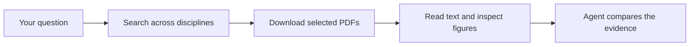

<!-- mcp-name: io.github.aytzey/paper-pilot -->
# Paper Pilot

**Let Codex and Claude find, download, and read full research papers.**

Search six academic databases, read methods and results page by page, inspect figures, and get back to the decision you are trying to make. Paper Pilot is a local MCP server; your existing AI agent does the reasoning.

[](https://github.com/aytzey/paper-pilot/actions/workflows/ci.yml)
[](LICENSE)
[](pyproject.toml)

[Install](#quick-start) · [Real example](examples/full-paper-walkthrough.md) · [Reading guide](docs/READING.md) · [Report a problem](https://github.com/aytzey/paper-pilot/issues/new/choose)

## Quick start

Install [uv](https://docs.astral.sh/uv/getting-started/installation/) and [Git](https://git-scm.com/downloads) if needed. Choose your client:

**Codex**

```bash
codex mcp add paper_pilot -- uvx --from git+https://github.com/aytzey/paper-pilot paper-pilot
```

**Claude Code**

```bash
claude mcp add --scope user paper-pilot -- uvx --from git+https://github.com/aytzey/paper-pilot paper-pilot
```

Restart your client, then ask:

> Use Paper Pilot to find “Attention Is All You Need”. Read the full paper, inspect the architecture figure, and explain the method and its limitations with PDF page citations.

No account, API key, email setup, or Zotero installation is required by Paper Pilot. Your AI client's own access and usage costs still apply. The first launch installs Python dependencies; academic APIs can rate-limit requests.

**Claude Desktop or Cursor:** use the [copyable JSON configuration](#mcp-client-setup).

**Try the tools without an AI client:**

```bash
uvx --from git+https://github.com/aytzey/paper-pilot paper-pilot demo "retrieval augmented generation"
```

The CLI downloads accessible papers, saves a reading pack, and opens a citation graph. It does not run an LLM or write a finished research conclusion. Results go into `./data/` by default. These commands install from GitHub; a PyPI release is not required.

## See what reaches your agent

In a recorded stdio MCP check, **Attention Is All You Need** was delivered as 15 pages of text across four responses. All **39,498 extracted characters** arrived in order. The original **2,215,244-byte PDF** also arrived unchanged through both supported PDF transfer paths.

| What was checked | Recorded result |
|---|---|
| Whole-document text | Every batch joined to exactly match extraction from all PDF pages |
| Original PDF | Returned bytes matched the downloaded file |
| A multidisciplinary example | Two soil-pH papers: 37 pages, 96,163 characters, nine responses |

Read the [walkthrough and reproduction steps](examples/full-paper-walkthrough.md) or inspect the [verification data](examples/full-text-verification.json). This verifies delivery, not model comprehension. Codex and Claude UI sessions were not tested in that check.

## Research a practical decision

Start with something you need to decide:

> I want to build an inexpensive circuit to measure soil pH. Use Paper Pilot to investigate soil science, electrode materials, and electronics, starting with recent papers and following foundational references. Read the decisive papers in full. Compare cost, calibration, drift, and measurement conditions. Recommend an approach, cite the evidence, and propose the first experiment to validate it.

The server supplies research instructions alongside its tools: split the question across disciplines, continue the relevant searches, inspect the full papers, seek contrary evidence, and disclose gaps before recommending an approach.

Other useful starting points:

| Your decision | Ask your agent |
|---|---|
| Choose a RAG design | “Compare recent RAG approaches for my document set. Read the evaluation sections and explain which results transfer to my constraints.” |
| Understand a disputed result | “Find papers supporting and challenging this claim. Compare their methods and conditions with page citations.” |
| Inspect a paper you already have | “Read this PDF completely. Check the main figures and list the assumptions behind its conclusion.” |

Search covers **Semantic Scholar, OpenAlex, arXiv, Crossref, Europe PMC, and DOAJ**. A working PDF is used directly; missing or failed PDFs are resolved through Unpaywall, with OpenAlex recovery if its API fails. Zotero sync is optional.

## How full-paper reading works


```mermaid
flowchart LR
    Q[Your question] --> S[Search across disciplines]
    S --> P[Download selected PDFs]
    P --> R[Read text and inspect figures]
    R --> A[Agent compares the evidence]
```

- **Text:** `read_pdf_text` returns consecutive pages with continuation cursors, including pages longer than a single response.
- **Figures and tables:** `render_pdf_pages` returns page images for visual inspection.
- **Original file:** `read_pdf_document` provides the PDF when your agent needs it and the client supports that delivery path.
- **Evidence trail:** retain source, DOI, PDF page, access location, and extraction warnings.

The agent must follow every continuation to complete a text read. Scanned PDFs without a text layer are reported as unreadable; OCR is outside the project scope. Search results reflect returned provider pages, so exhaustive literature coverage is not guaranteed.

See the [tool-level reading guide](docs/READING.md) for exact calls, access rules, and limits.

## MCP client setup

For Claude Desktop or Cursor, add this server to your MCP configuration:

```json
{
  "mcpServers": {
    "paper-pilot": {
      "command": "uvx",
      "args": ["--from", "git+https://github.com/aytzey/paper-pilot", "paper-pilot"]
    }
  }
}
```

Ready-to-copy files: [Claude Desktop](examples/claude-desktop.mcp.json) · [Cursor](examples/cursor.mcp.json) · [Codex](examples/codex.config.toml).

On Windows, if the client cannot find `uvx`, use the executable's full path from `where.exe uvx`. Keep the arguments unchanged. [Client setup](docs/CLIENTS.md) covers configuration locations, local checkouts, updates, PDF capabilities, and optional Zotero setup.

## Where Paper Pilot fits

Use it when you want your existing agent to research a question across disciplines and inspect the actual papers. If your main task is different, these projects are also worth a look:

| Project | Main focus |
|---|---|
| [arxiv-mcp-server](https://github.com/blazickjp/arxiv-mcp-server) | arXiv literature workflows, original LaTeX section reads, BibTeX, and topic watches |
| [zotero-mcp](https://github.com/54yyyu/zotero-mcp) | Working with an existing Zotero library through an AI assistant |
| [PaperQA](https://github.com/Future-House/paper-qa) | A RAG system for answering questions from scientific documents with citations |

These are different starting points, not a quality ranking. Paper Pilot does not include its own LLM or require a vector database.

## Contribute a real research case

Try a paper or decision you know well. If the agent misses a source, cannot retrieve a PDF, or loses part of a page, [open an issue](https://github.com/aytzey/paper-pilot/issues/new/choose) with the DOI, client, and failed step. A small reproducible case is particularly useful.

For code contributions, see [CONTRIBUTING.md](CONTRIBUTING.md). The most useful work is reliable source access, reading correctness, and verified client instructions.

[Architecture](docs/ARCHITECTURE.md) · [Agent instructions](AGENTS.md) · [Codex guide](CODEX.md) · [Claude guide](CLAUDE.md) · [Optional integrations](docs/EXTRAS.md)

MIT licensed. If this is useful for your next research task, [star Paper Pilot](https://github.com/aytzey/paper-pilot) to keep it handy. Sharing a case that worked helps other people decide whether to try it.
