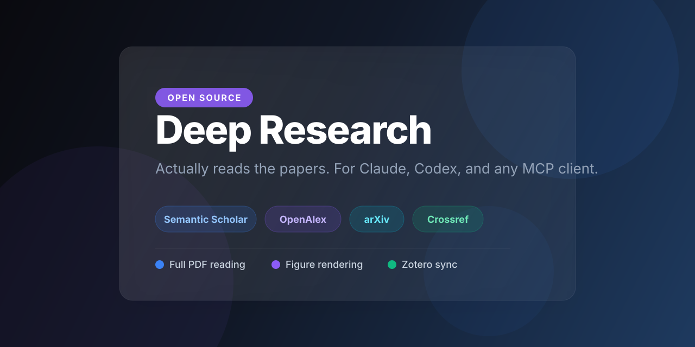
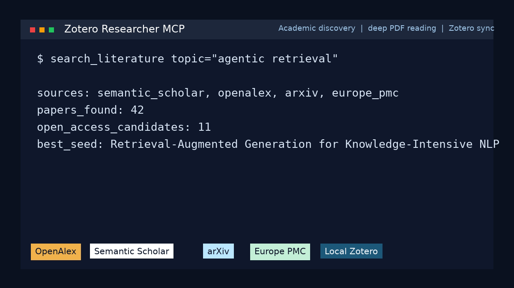
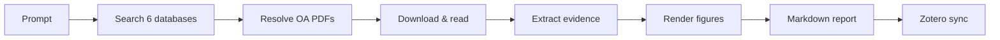

<!-- mcp-name: io.github.aytzey/paper-pilot -->


# Paper Pilot

**Give any MCP-capable agent real academic research: 17 tools over 6 scholarly databases, sequential PDF full-text reading, cited evidence extraction, citation graphs, and Zotero sync.**

Paper Pilot searches academic databases, downloads PDFs, and delivers their text to your agent in page order, including methods, results, references, and appendices. The agent follows explicit continuation cursors to read the whole document, inspects figures as images, and can save the papers in Zotero.

[](https://github.com/aytzey/paper-pilot/actions/workflows/ci.yml)
[](https://github.com/aytzey/paper-pilot/releases)
[](LICENSE)
[](pyproject.toml)
[](https://github.com/aytzey/paper-pilot/stargazers)

---



---

## Quick start

**Try it in 30 seconds. No MCP client, no config:**

```bash
# straight from GitHub (works today):
uvx --from git+https://github.com/aytzey/paper-pilot paper-pilot demo "retrieval augmented generation"

# once published to PyPI:
uvx paper-pilot demo "retrieval augmented generation"
```

This searches 6 academic databases, downloads open-access PDFs, extracts their text into a reading pack, and opens an **interactive citation graph** in your browser. The demo does not run an LLM or produce a completed full-paper synthesis.

👉 **See a real run, no install needed:** [sample report](examples/sample-report.md) · [interactive citation graph](examples/sample-citation-graph.html)

### Then plug it into your AI agent

Wire it into your MCP client ([setup below](#mcp-client-setup)), set a free `OPENALEX_EMAIL`, and ask:

> *Research retrieval-augmented generation, deep-read the top papers, and compare the methods.*

---

## How it works


```mermaid
graph LR
    A[Prompt] --> B[Search 6 databases]
    B --> C[Resolve OA PDFs]
    C --> D[Download & read]
    D --> E[Extract evidence]
    E --> F[Render figures]
    F --> G[Markdown report]
    G --> H[Zotero sync]
```

One prompt searches six academic databases, downloads the real PDFs, and returns real citations.

```
Research retrieval-augmented generation, deep-read the top papers, and compare the methods.
```

Your AI will:

1. Search **Semantic Scholar**, **OpenAlex**, **arXiv**, **Crossref**, **Europe PMC**, and **DOAJ**
2. Find the open-access PDFs, not abstracts
3. Download PDFs and read every `read_pdf_text` batch until `next_cursor` is `null`
4. Extract evidence chunks with source attribution
5. Inspect figures/tables as page images when needed
6. Write a structured Markdown report
7. Optionally save the papers into your **Zotero** library

---

## Read the whole paper in Codex or Claude

Ask your agent:

> Find papers on <topic>. Use deep_read_topic, read each deep_reads[*].full_text batch,
> then call read_pdf_text with its pdf_path and next_cursor until null. Read every page,
> including references and appendices. Render figures and tables. Report unreadable pages
> and cite PDF page numbers; do not substitute abstracts or top_chunks for a full read.

`deep_read_topic` and `extract_local_pdf_text` deliver the first sequential text batch automatically.
For a specific PDF URL, call `inspect_open_access_pdf`, then `read_pdf_text` on its returned `pdf_path`.
Continue with the same path and the returned `start_page` / `start_char`. Each response carries at most
12,000 text characters by default; even an oversized page continues at the exact character.

The agent can request the **original PDF whenever the task needs it**, without first finishing text
reading: call `read_pdf_document`, then open the returned local file or fetch its MCP resource link
to receive the PDF bytes. Set `embed_base64=true` when the client supports embedded PDFs (within the
tool's size/page limits). Choose text, the PDF, or page images based on the task; receiving the file
alone does not establish that it was read.

| Reading option | What reaches the model | Use |
|---|---|---|
| Abstract / `top_chunks` | Summary or selected, shortened excerpts | Discovery and navigation |
| `read_pdf_text` | Consecutive page text with a continuation cursor | Full-text reading in any MCP client |
| `render_pdf_pages` | Page images | Figures, tables, formulas, extraction checks |
| Local PDF / embedded PDF | File path or optional PDF bytes | Clients that support direct PDF inspection |

`extraction_status` and `pages_without_text` expose extraction gaps. PDFs need an extractable text layer;
pages without one are reported as unreadable. Text extraction can miss layout or symbols:
inspect relevant page images and disclose gaps.
PDFs are stored locally; returned text/images are sent to the configured AI client.

`end_of_document` means the cursor reached the end. It does **not** certify that the agent read earlier
batches. Reading packs and reports contain excerpts, and must not be presented as completed syntheses.

## Research a practical decision

For example: “I want to build a cheap circuit to measure plant-soil pH. Research the relevant
soil science, electrode materials and electronics, starting with recent work, and recommend
an approach I can build and validate.”

The MCP initialization instructions guide the agent to clarify the decision, split it into
discipline-specific questions, search recent work and foundational references, fully read decisive
papers, seek contradictory evidence, and compare alternatives under comparable conditions.
The final recommendation should include sources/pages, rejected alternatives, unresolved questions
and a first validation experiment. The agent performs the reasoning; the server supplies access
and reading tools. Instruction delivery alone does not guarantee the agent followed every step.

Start each discovery query with:

```python
search_literature(
    topic="soil pH reference electrode stability",
    sort_by="newest",
    open_access_only=False,
    limit_per_source=5,
)
```

Inspect `source_status`. To go deeper in one database, pass its `next_request` arguments back
to `search_literature` unchanged. A failed source has a `retry_request`; failure is not exhaustion.
Download the selected paper with `inspect_open_access_pdf(pdf_url=..., doi=...)`, then read its
text/PDF. This preserves the selection instead of rerunning a broad download pipeline.

`newest` requests native date ordering: publication dates where available, first submission for
arXiv, and year precision for DOAJ. Each record includes its date precision and source; partial
dates are not padded with invented days. Crossref date paging stops at 10,000 records; narrow
the query/year range to continue. Results cover returned provider pages, not the entire literature
in global date order. Metadata may be cached for `CACHE_TTL_SEC`; access and coverage gaps stay visible.
The existing default remains relevance ranking and `open_access_only=True`.

The detailed product scope and pH case are in [Research decisions](docs/RESEARCH_DECISIONS.md).

---

## MCP client setup

Works on Claude Desktop, Cursor, Claude Code, and Codex, across Windows, macOS, and Linux. Full per-OS config-file locations, the Windows `spawn uv ENOENT` fix, and a per-client capability matrix are in [docs/CLIENTS.md](docs/CLIENTS.md).

### Claude Desktop

Add to `claude_desktop_config.json` (macOS: `~/Library/Application Support/Claude/`, Windows: `%APPDATA%\Claude\`; Claude Desktop has no Linux build, so use Claude Code on Linux):

```json
{
  "mcpServers": {
    "paper-pilot": {
      "command": "uv",
      "args": ["--directory", "/path/to/paper-pilot", "run", "paper-pilot"],
      "env": {
        "OPENALEX_EMAIL": "you@example.com",
        "UNPAYWALL_EMAIL": "you@example.com",
        "ZOTERO_LOCAL": "true"
      }
    }
  }
}
```

### Claude Code

```bash
claude mcp add --scope user paper-pilot -- uv --directory /path/to/paper-pilot run paper-pilot
```

### Codex

Add to `~/.codex/config.toml`:

```toml
[mcp_servers.paper_pilot]
command = "uv"
args = ["--directory", "/path/to/paper-pilot", "run", "paper-pilot"]

[mcp_servers.paper_pilot.env]
OPENALEX_EMAIL = "you@example.com"
ZOTERO_LOCAL = "true"
```

### Cursor

Put this at `.cursor/mcp.json` (this repo) or `~/.cursor/mcp.json` (global), then enable it in Settings (`Cmd/Ctrl+Shift+J`) under Model Context Protocol. See [examples/cursor.mcp.json](examples/cursor.mcp.json).

```json
{
  "mcpServers": {
    "paper-pilot": {
      "command": "uv",
      "args": ["--directory", "/path/to/paper-pilot", "run", "paper-pilot"],
      "env": { "OPENALEX_EMAIL": "you@example.com", "UNPAYWALL_EMAIL": "you@example.com", "ZOTERO_LOCAL": "true" }
    }
  }
}
```

### Windows note

Claude Desktop and Cursor spawn the command without a shell, so a bare `uv`/`uvx` can fail with `spawn uv ENOENT`. Wrap it (`"command": "cmd", "args": ["/c", "uv", "--directory", "C:\\path\\to\\paper-pilot", "run", "paper-pilot"]`) or use the full path from `where uv`.

### Streamable HTTP mode

```bash
paper-pilot --transport streamable-http --host 127.0.0.1 --port 8000
```

---

## Tools

| Tool | What it does |
|---|---|
| `research_topic` | Full pipeline: search, download, report, optional citation graph + Zotero sync |
| `deep_read_topic` | Everything above + full-text extraction with evidence chunks |
| `graph_topic` | Render an interactive citation / relatedness graph (HTML) for a topic |
| `render_pdf_pages` | Render PDF pages as images the model can see (figures, tables, layout) |
| `read_pdf_document` | Return a downloaded PDF's local path and resource link (embed base64 only on request) |
| `get_pdf_page_text` | Exact text of specific PDF pages as JSON, for fine-grained lookups (no base64) |
| `read_pdf_text` | Sequential full text over MCP with exact continuation cursors |
| `search_literature` | Fine-grained multi-source academic search (6 databases) |
| `find_similar_papers` | Related work expansion from a seed paper |
| `inspect_open_access_pdf` | OA availability check and PDF preview |
| `extract_local_pdf_text` | Text extraction from any local PDF |
| `list_zotero_collections` | List collections in your local or web Zotero library |
| `healthcheck` | Verify all connections are up |

Four additional optional tools (disabled by default) are documented in [docs/EXTRAS.md](docs/EXTRAS.md).

> Prefer the CLI? `paper-pilot demo "<topic>"` runs the whole pipeline and opens the citation graph. No MCP client required.

---

## Who uses this

**PhD students** that don't want to spend a week on a literature review. Point it at your thesis topic, get back a structured comparison with real citations and the PDFs already in Zotero.

**Research labs** that want to scan preprints weekly and auto-file them. Run `research_topic` on a schedule and keep your group library current.

**AI builders** that need their agents to work with real academic papers instead of web scraping snippets.

---

## Configuration

**Use an available full-paper PDF directly. Unpaywall resolves missing or failed PDFs by DOI.**
Configure `UNPAYWALL_EMAIL` (falls back to `OPENALEX_EMAIL`) for that fallback;
working PDF downloads do not require it. A URL is tried before making an extra lookup.
The integration follows the DOI/location model in the [roadoi guide](https://cran.r-project.org/web/packages/roadoi/vignettes/intro.html)
using the existing Python Unpaywall v2 client; no R installation is needed.

When Unpaywall is needed, downloads try `best_oa_location` and then other `oa_locations` PDF URLs.
Landing pages and embargoed future locations are not treated as downloadable PDFs.
`paper.raw.unpaywall` exposes lookup status, OA locations and licensing metadata;
`paper.raw.pdf_download` identifies the copy actually downloaded. Missing email is reported only
for records needing Unpaywall; it does not block working PDFs. API failures are reported even
when OpenAlex supplies a fallback. DOI-less search records are marked
`not_applicable` and keep their direct OA access. Valid cached Unpaywall responses can be reused.
An openable PDF might still be a cover or abstract: the agent must inspect the content. In that case,
call `inspect_open_access_pdf(doi="...", pdf_url=None)` to request Unpaywall alternatives explicitly.

```bash
OPENALEX_EMAIL=you@example.com        # Required for polite API access
UNPAYWALL_EMAIL=you@example.com       # Required when Unpaywall fallback is needed
SEMANTIC_SCHOLAR_API_KEY=             # Optional, higher rate limits

# Local Zotero
ZOTERO_LOCAL=true
ZOTERO_LIBRARY_TYPE=user
ZOTERO_DATA_DIR=                       # optional: relocated/sandboxed Zotero data dir (default ~/Zotero)

# Web Zotero API (alternative)
ZOTERO_LIBRARY_ID=
ZOTERO_API_KEY=

# Storage
PAPER_PILOT_DATA_DIR=./data
MAX_DOWNLOAD_MB=75                     # per-PDF download size cap
PAPER_PILOT_ALLOW_EXTERNAL_PDF=true   # read PDFs outside the data dir (set false on networked transports)
PDF_EMBED_MAX_MB=5                     # size cap for an embedded PDF resource
PDF_EMBED_MAX_PAGES=60                 # page cap for an embedded PDF resource

# Institutional networks
HTTP_PROXY=
HTTPS_PROXY=
SSL_CERT_FILE=
```

---

## Project structure

```
src/paper_pilot/
  server.py              MCP tools and pipeline orchestration
  cli.py                 Server entry point + `demo` subcommand
  demo.py                Zero-config one-command demo runner
  config.py              Environment and settings
  services/
    academic.py          Multi-source scholarly search (6 databases)
    open_access.py       OA resolution and PDF downloads
    scihub.py            Sci-Hub paper resolution (opt-in)
    deep_read.py         Full-text extraction and page rendering
    zotero.py            Local and web Zotero integration
    reporting.py         Markdown report + synthesis comparison tables
    graphing.py          Interactive citation-graph HTML export
    content.py           PDF/image MCP content blocks (pages as images, embedded PDF)
    libgen.py            Supplementary LibGen support
    net.py               SSRF guard + size-capped downloads
```

Architecture details: [docs/ARCHITECTURE.md](docs/ARCHITECTURE.md)

---

## For AI agents

- [AGENTS.md](AGENTS.md): shared operating guide
- [CLAUDE.md](CLAUDE.md): Claude Desktop and Claude Code setup
- [CODEX.md](CODEX.md): Codex setup
- [docs/CLIENTS.md](docs/CLIENTS.md): side-by-side client comparison

---

## Contributing

PRs welcome. The most impactful areas:

- New scholarly source adapters
- Better OA resolution logic
- PDF parsing improvements
- More MCP client configs

See [CONTRIBUTING.md](CONTRIBUTING.md).

---

## Disclaimer

This tool is designed for academic research and educational purposes only. Open-access features use only legal, publicly available sources. Optional, disabled-by-default integrations are covered in [docs/EXTRAS.md](docs/EXTRAS.md).

---

## License

MIT. Do whatever you want with it.

If this helps your research, [star the repo](https://github.com/aytzey/paper-pilot) and tell a colleague.
